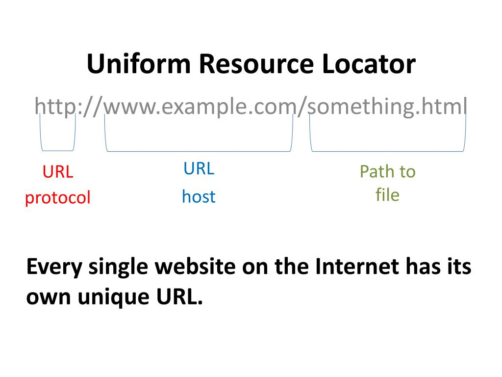
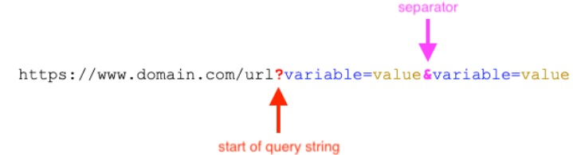
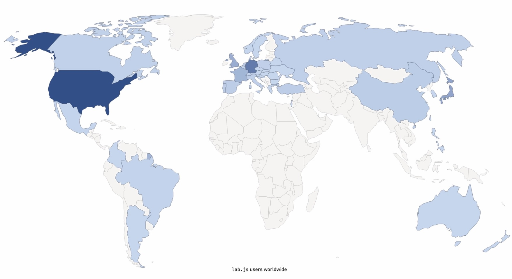
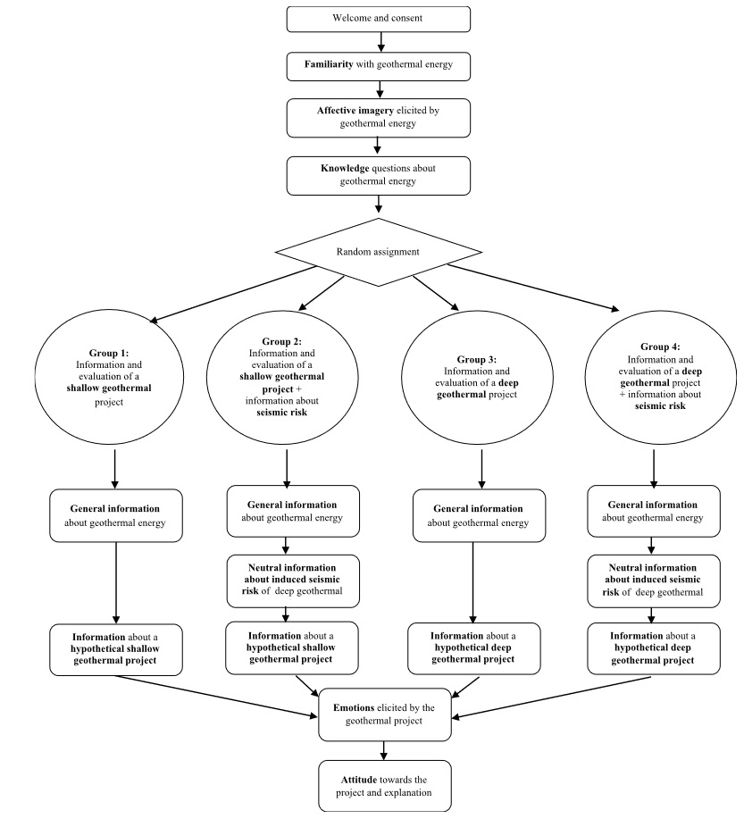
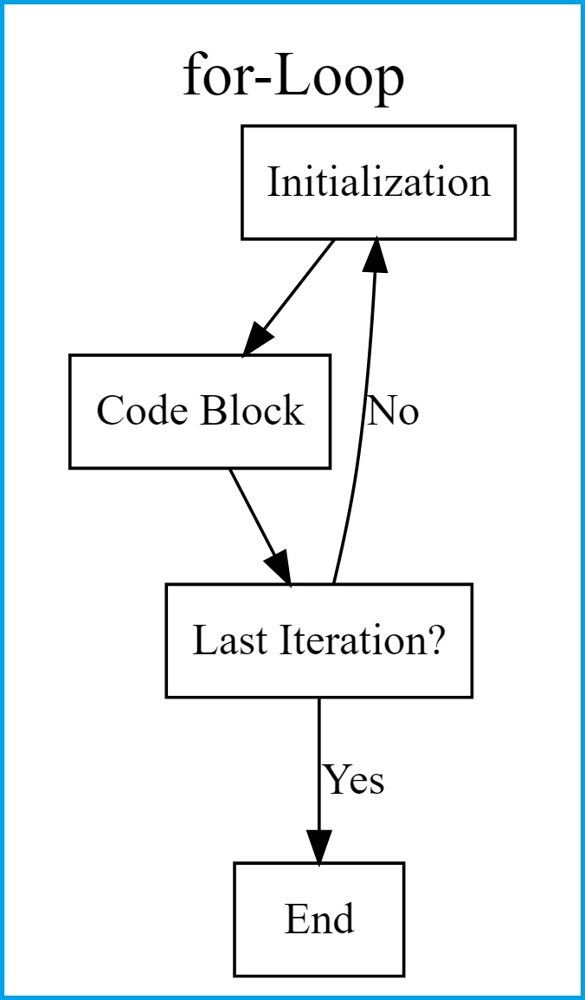
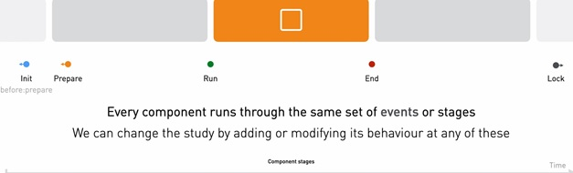
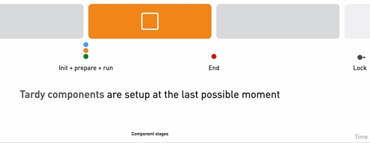
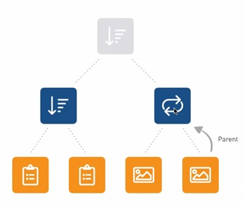
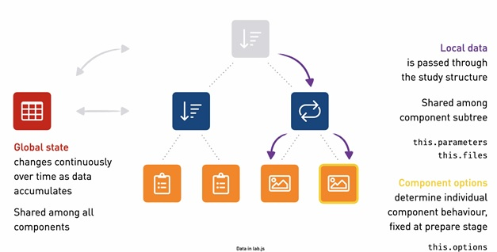

```{r setup, include=FALSE, message = FALSE, warning=FALSE}
options(htmltools.dir.version = FALSE)
# library(igraph)
# library(tidyverse)
# library(tictoc)
# library(microbenchmark)
# library(benchmarkme)
# library(bench)
# library(data.table)
# library(kableExtra)
# library(xlsx)

library(RefManageR)
BibOptions(check.entries = FALSE, bib.style = "authoryear", style = "markdown",
           dashed = TRUE)
file.name <- system.file("Bib", "LibrarySubset.bib", package = "RefManageR")
# file.name <- system.file("Bib", "biblatexExamples_kolloq.bib", package = "RefManageR")
bib <- ReadBib(file.name)
# bib
```


```{css, echo=FALSE}
.scrollChunk {
  max-height: 350px;
  overflow-y: auto;
  background-color: inherit;
}

.scrollChunkSmall {
  max-height: 200px;
  overflow-y: auto;
  background-color: inherit;
}
```


<!-- *********** NEW SLIDE ************** -->

## Talk

.pull-left[
This talk consists of four parts:

1. webpages: basics

2. programming languages

  + .html
  + .css
  + .js

3. lab.js

  + overview
  + components (+ Flow Control)
  + components stages (+ Page Builder / HTML Form for surveys)
  + local / global variables
  
4. IF time set up first studies / Slack group?

]


.pull-right[

<br>
<br>
<center>

</center>

]


<!-- *********** NEW SLIDE ************** -->

<!-- *********** HEADING ************** -->
---
class: heading,middle


Part 1: webpages: basics


<!-- *********** NEW SLIDE ************** -->
---
## websites: URL

* Uniform Resource Locator (URL), also called web address
* specifies the location on a computer network, consists of 
  * protocol
  * host (domain name gets translated to IP)
  * path to files
    * central agency: *Internet Assigned Numbers Authority*

<br>

<center>

</center>


<!-- *********** NEW SLIDE ************** -->
---
## websites: URL parameters

* a way to structure additional information for a given URL


<br>

<center>

</center>


--
.pull-left[


````markdown
URL with one parameter

https://google.de/?q=SELFHTML

````
]

--

.pull-right[
````markdown
URL with multiple parameters

https://example.org/?a=1&b=2&c=3

````
]

--


--
.pull-left[
problem - maximum length of a URL in different browsers:

see: https://stackoverflow.com/questions/417142/what-is-the-maximum-length-of-a-url-in-different-browsers
]


.pull-right[

.scrollChunkSmall[
````markdown
Browser     Address bar   document.location
                          or anchor tag
------------------------------------------
Chrome          32779           >64k
Android          8192           >64k
Firefox          >64k           >64k
Safari           >64k           >64k
IE11             2047           5120
Edge 16          2047          10240

````
]
]


<!-- *********** NEW SLIDE ************** -->
---
## importance of URL parameters: static vs. dynamic webpages

* **get a unique identifier to link your data sets (primary key)**
* static webpages: a web page that is delivered to the user's web browser exactly as stored (often plain HTML documents)
* dynamic webpages: is generated by a web application processing server-side scripts (e.g. using JavaScript)

<br>

--
.pull-left[
<center>

</center>
]

--

.pull-right[
<center>

</center>
]


`r Citet(bib, c("nixon2012learning"))`; [or use cookies]


<!-- *********** NEW SLIDE ************** -->
---
## importance of unique identifier

* to link data sets, which are saved one one / multiple server(s), you need a primary key


<center>

</center>


Managing online experiments with JATOS: https://www.youtube.com/watch?v=1xdB-qYxfiE&t=5s


<!-- *********** NEW SLIDE ************** -->
---
class: small
## websites: .html, .css, .js

<center>

</center>

[https://brytdesigns.com/html-css-javascript-whats-the-difference/](https://brytdesigns.com/html-css-javascript-whats-the-difference/)

<!-- *********** NEW SLIDE ************** -->

<!-- *********** HEADING ************** -->
---
class: heading,middle


Part 2: programming languages: .html, .css, .js


<!-- *********** NEW SLIDE ************** -->
---
class: small
## .html

Hypertext Markup Language, first proposed by Tim Berners-Lee (1989), central agency: *World Wide Web Consortium*

--
.pull-left[


````markdown
<html>
<head>
    <title>First HTML</title>
</head>

<header>
    <h1> Hello World </h1>
</header>
<body>
    I am your first HTML-file!
</body>
<footer>
    Bye bye
</footer>
</html>
````
]

--

.pull-right[
<center>

</center>
]


--
What makes HTML so powerful is its marked up structure, e.g. title tag:

````markdown
<title> Hello World </title>
````


<!-- *********** NEW SLIDE ************** -->
---
class: small
## .html tags


* All HTML tags are enclosed in `<>`
* Every HTML tag performs a different function
* Most HTML tags have opening `<tag>` and closing `</tag>`


--
.pull-left[
heading tags:

````markdown
<h1>Heading 1</h1>

<h2>Heading 2</h2>

<h3>Heading 3</h3>

<h4>Heading 4</h4>

<h5>Heading 5</h5>

<h6>Heading 6</h6>
````
]

--

.pull-right[
when you want to structure content... 

* into a paragraph

````markdown
<p>Content for first paragraph.</p>

<p>Content for the second paragraph.</p>
````

* into different sections

````markdown
<section>
<h2>Heading 2</h2>
<p>Content for first paragraph</p>
</section>
````
]

19 Commonly Used HTML Tags: https://geekflare.com/html-tags/

see overview of HTML tags: https://www.w3schools.com/tags/tag_comment.asp


<!-- *********** NEW SLIDE ************** -->
---
class: small
## .html attributes

HTML attributes provide additional information about HTML elements.
* All HTML elements can have attributes
* Attributes provide additional information about elements
* Attributes are always specified in the start tag
* Attributes usually come in name/value pairs like: name="value"


--
.pull-left[
* style attribute: add styles to an element, such as color, font, size, and more

````markdown
 <p style="color:red;">This is a red paragraph.</p> 
````

* href attribute: specifies the URL of the page the link goes to
* target attribute: specifies where to open the linked document

````markdown
 <a href="https://www.w3schools.com" target="_blank">Visit W3Schools</a> 
````
]

--

.pull-right[

 <p style="color:red;">This is a red paragraph.</p> 

<br>
<br>

 <a href="https://www.w3schools.com" target="_blank">Visit W3Schools</a> 
]


<!-- *********** NEW SLIDE ************** -->
---
class: small
## .html: tree-structure


--
.pull-left[


````markdown
<html>
  <head>
      <title>First HTML</title>
  </head>
  
  <body>
      I am your first HTML file!
  </body>
</html>
````
]

--

.pull-right[
<center>

</center>
]

allows to treat HTML as a tree stucture $\rightarrow$ Document Object Model, see [https://www.w3schools.com/whatis/whatis_htmldom.asp](https://www.w3schools.com/whatis/whatis_htmldom.asp), which allows web scraping


`r Citet(bib, c("munzert2014automated"))`


<!-- *********** NEW SLIDE ************** -->
---
class: small
## .html example of well-structured page

HTML has several semantic elements that define the different parts of a web page:
* `<head>` - is a container for the following elements: `<title>`, `<style>`, `<script>`, `<meta>`,..
* `<header>` - Defines a header for a document or a section
* `<body>` - Defines the document's body (contains all the contents of an HTML document, such as headings, paragraphs, images, hyperlinks, tables, lists, etc.)
* `<header>` - Defines a footer for a document or a section


.scrollChunk[
````markdown
<!DOCTYPE html>
<html>

<head>
<style>
body {
  background-color: red;
}
</style>
</head>

<header>
My frist header
</header>

<body>
<section>
<h3>Title of body</h3>
<p><a href="https://www.w3schools.com">Link to w3schools</a> within a paragraph</p>
</section>

</body>

<footer>
I am the footer
</footer>
</html>
````
]


<!-- *********** NEW SLIDE ************** -->
---
class: small
## .html example of well-structured page translated

Everything you see in a browser is parsed and interpreted by your web browser (! html is markup language not a programming language).


<br>
Remark: the HTML is not well formatted:

<html>
<head>
<style>
#makeMeRed {
  background-color: red;
}
</style>
</head>

<div id="makeMeRed">
<header>
My frist header
</header>

<body>
<section>
<h3>Title of body</h3>
<p><a href="https://www.w3schools.com">Link to w3schools</a> within a paragraph</p>
</section>

</body>

<footer>
I am the footer
</footer>
</div>
</html>


<!-- *********** NEW SLIDE ************** -->
---
class: small
## .css

Cascading Style Sheets: a language for describing the layout of HTML (and other markup documents)

--
.pull-left[

````markdown
`r ''`
<html>
<head>
    <title>First HTML</title>
</head>

<header>
    <h1 style="font-size: 22px;"> Hello World </h1>
</header>
<body>
    I am your first HTML-file!
</body>
<footer style="background-color: red;">
    Bye bye
</footer>
</html>
````
]

--

.pull-right[
<center>

</center>
]

adjustable using css selectors (Web Dev Simplified): [https://www.youtube.com/watch?v=l1mER1bV0N0](https://www.youtube.com/watch?v=l1mER1bV0N0)


<!-- *********** NEW SLIDE ************** -->
---
class: small
## .js

JavaScript: allows the browser to change the content and structure of the document after it has
been loaded from the server, enabling user interaction and event handling

--
.pull-left[

````markdown
`r ''`
<html>
<head>
    <title>First HTML</title>
</head>

<header>
    <h1 style="font-size: 22px;"> Hello World </h1>
</header>
<body>
    I am your first HTML-file!
</body>
<footer style="background-color: red;">
    Bye bye
</footer>
</html>

<script>
    document.querySelector('footer').addEventListener("click", () => {
	alert('IEEEE you clicked on the footer!');
})
</script>
````
]

--

.pull-right[
<center>

</center>
]

play around with event listeners (w3schools): [https://www.w3schools.com/js/js_htmldom_eventlistener.asp](https://www.w3schools.com/js/js_htmldom_eventlistener.asp)


<!-- *********** NEW SLIDE ************** -->
---
## .js: DOM event types

* mouse events: mousedown, mouseup, click, dblclick, mousemove, mouseover, mousewheel, mouseout, contextmenu
* touch events: touchstart, touchmove, touchend, touchcancel
* keyboard events: keydown, keypress, keyup
* form events: focus, blur, change, submit
* window events: scroll, resize, hashchange, load, unload


used eventListeners to build up the interactive parts for users: [https://camgalaxy.github.io/](https://camgalaxy.github.io/)


<!-- *********** NEW SLIDE ************** -->
---
## .html, .css, .js: materials

* lab.js documentation (tutorial videos): https://labjs.readthedocs.io/en/latest/learn/builder/index.html
* to learn JavaScript
  * book: https://eloquentjavascript.net/
* w3schools to learn HTML, CSS, JavaScript, PHP (all you need to build up the most fancy experiments you can imagine): https://www.w3schools.com/

<br>
<br>
self paced courses:
<br>
for free:
* introduction to HTML: https://www.freecodecamp.org/learn/2022/responsive-web-design/
* introduction to Java Script: https://www.freecodecamp.org/learn/javascript-algorithms-and-data-structures/

<br>
not free:
* all kind of courses: https://www.codecademy.com/
* focused on statistics and SQL, e.g.: https://www.datacamp.com/tracks/sql-fundamentals


<!-- *********** HEADING ************** -->
---
class: heading,middle


Part 3: lab.js - overview


<!-- *********** NEW SLIDE ************** -->
---
## lab.js: ?!??


Let's start the fun or coffee first? 

<center>

</center>


<!-- *********** NEW SLIDE ************** -->
---
## where is lab.js currently used


<center>

</center>


<!-- *********** NEW SLIDE ************** -->
---
## why lab.js is so powerful


<center>

</center>

plus two examples

see also data structure of lab.js: https://labjs.readthedocs.io/en/latest/reference/data%20format.html


<!-- *********** NEW SLIDE ************** -->
---
## linear study flow + communication

If you want to communicate your planned experiment to someone else, you can simply draw the linear study flow: 

<center>

</center>


you could use the yEd graph editor (free): https://www.yworks.com/products/yed


<!-- *********** NEW SLIDE ************** -->
---
## check out the example studies (space shuttle)

and work through the videos of lab.js...

<br>
you probably won't be as relaxed as this cat: 

<center>

</center>


<!-- *********** HEADING ************** -->
---
class: heading,middle


Part 3: lab.js - components


<!-- *********** NEW SLIDE ************** -->
---
## central components

there are two central components: 

* **screens** or **HTML pages** are presented to participants sequentially
* **sequences** experiment itself is most likely a sequence of screens, but on a finer level, trials are also often composed of several distinct phases that appear in sequence (fixation cross, stimulus, ISI)


<br>
=> All components need some preparation before they can be presented (e.g. preloading of content), and before they can be run. 

=> Every components might wait for a response and then end, or terminate automatically after a certain time period, or both.


<!-- *********** NEW SLIDE ************** -->
---
## central tabs within components

three different tabs listed at the top right of the interface:
<br>


you can include **Content** using 
* Canvas screens:  used to draw graphics, on the fly, via JavaScript
* HTML


<br>
<br>
or **Changing components’ behavior**: 

* behavior tab determines its behavior during the study: Here, the topmost set of options provides a visual representation of the component timeline on which additional events and stimuli can be scheduled (e.g., sounds), as well as a timeout after which the study moves on to the next component
* script tab enables use to include JavaScript on different component stages


<!-- *********** NEW SLIDE ************** -->
---
## focus on the scripts tab - get overall feedback

HTML:
.scrollChunkSmall[
````markdown
<header class="content-vertical-center content-horizontal-center">
  <h1>Feedback</h1>
</header>
<main>
  <p>
In the example trial you answered <span id="howManyRight">XXX</span> out of 4 right.
  </p>
</main>
<footer class="content-vertical-center content-horizontal-center">
  Please press the space bar when you're ready to continue.
</footer>
````
]

JavaSript:
.scrollChunkSmall[
````markdown
var arrayCorrect = study.options.datastore.extract("correct");
var counterCorrect = 0;


arrayCorrect.forEach((element) => {
  if(element == true){
    counterCorrect++;
  }
})

document.getElementById("howManyRight").textContent = counterCorrect;
````
]


<!-- *********** NEW SLIDE ************** -->
---
## focus on the scripts tab

to set up complex study flows you need to implement two central flow controls: 

* if statements (filter conditions)
* loops (e.g. decision tasks)


<!-- *********** NEW SLIDE ************** -->
---
## Flow control - if statement

* use if statements alone
* or within loops

Normally we want to combine if statements with loops

<br>
**if statements** have the following form: 

```{r eval=FALSE}
## abstract representation
if (condition) true_action
if (condition) true_action else false_action
```

in action:

```{r eval=TRUE}
x1 <- if (TRUE) 1 else 2 # the experts write code like this!
x1
x2 <- if (FALSE) 1 else 2
x2
```


<!-- *********** NEW SLIDE ************** -->
---
## Flow control - if statement

If statements can be arbitrarily complex:

```{r eval=TRUE}
x <- 20

if (x > 30) {
  print("x > 30")
} else if (x <= 30 && x > 20) {
  print("x <= 30 && x > 20")
} else{
  print("everything else")
}
```


in JavaScript Comparison and Logical Operators: https://www.w3schools.com/js/js_comparisons.asp


<!-- *********** NEW SLIDE ************** -->
---
## focus on the scripts tab - get direct feedback

Set up a Canvas Screen and add within two text fields the following:

HTML:
.scrollChunkSmall[
````markdown
${ state.correct } 
${ state.correct ? 'Well done!' : 'Please respond as accurately as you can!' } 
````
]


If you want to check the state of the experiment (latest value of each variable): 
.scrollChunkSmall[
````markdown
study.state
study.state.correct
````
]

You could also provide feedback using a placeholder (see overall):
.scrollChunkSmall[
````markdown
if(study.state.correct == true){
document.getElementById("howManyRightEach").textContent = "nice one";
}else{
document.getElementById("howManyRightEach").textContent = "oh nooo";
}
````
]


<!-- *********** NEW SLIDE ************** -->
---
## Flow control - For Loop


.pull-left[

<center>

</center>

]

.pull-right[

```{r eval=TRUE}
for(i in 1:10) { # Head of for-loop
  x1 <- i^2 # Code block
  print(x1) # Print results
}
```

]

see multiple examples: https://statisticsglobe.com/for-loop-in-r


<!-- *********** NEW SLIDE ************** -->
---
## Flow control - For Loop


* loops repeat the same (single) template component, while varying parameters between repetitions
  + a loop is building the array of components itself, so a loop will auto generate a sequence internally


<br>
A loop is composed of a
* loop
* sequence: runs a group of components one after another
* stimulus
* fixation cross, ISI, feedback, ... or even nested loops


<br>
=> see file "loopexample.study.json" in folder Example Studies


<!-- *********** HEADING ************** -->
---
class: heading,middle


Part 3: lab.js - components stages


<!-- *********** NEW SLIDE ************** -->
---
## Component stages


every component will go through several distinct stages: 


.pull-left[
Init Stage:

* Load component options
* setup component basics, e.g. random number generators, ..


Prepare:

* resolve placeholders
* pre-load media
* pre-render where possible
* lock in component behavior

]


.pull-right[

Run: 

* present content or kick off nested components
* start listening for inputs

End: 

* stop listening for user input
* undo any changes to the page

]


see technical details: https://labjs.readthedocs.io/en/latest/reference/core.html#behavior


<!-- *********** NEW SLIDE ************** -->
---
## Components x Time:


<center>

</center>


if component is set to tardy: 


<center>

</center>

<!-- *********** NEW SLIDE ************** -->
---
## HTML Form and Page Builder


* a HTML Form is like a HTML screen, but listens to form submissions and extracts data
* provide a validator option to check provided data

````markdown
// data is submitted in the second try
var i = 0;
study.options.validator = function(data){
  debugger
  if(i++ === 0){
    return false;
  } else{
    return true;
  }
  debugger
}
````

* Page Builder: provides a user-interface to build HTML form pages


<!-- *********** NEW SLIDE ************** -->
---
## real-time adjustements within Page Builder

* Page Builder creates content from item options
  + these item options can be adjusted in real-time:
  
````markdown
debugger
this.options.items[1].width = 3
````

> important: in the before:prepare stage

<!-- *********** HEADING ************** -->
---
class: heading,middle


Part 3: lab.js - local / global variables


<!-- *********** NEW SLIDE ************** -->
---
## nested structure of lab.js


* lab.js has a nested, hierarchical structure
 + see tree structure of DOM (see: https://en.wikipedia.org/wiki/Document_Object_Model).


<center>

</center>


* Superordinate > subordinate
* Parents > Children

! If you have multiple nested components you can skip single loops / sequences by writing


````markdown
study.options.content[0].end() // or debugger and this
````


<!-- *********** NEW SLIDE ************** -->
---
## nested structure of lab.js: parameters vs. state


<center>

</center>


* parameters is tied to where you are in the experiment (limited to the individual screen)
  + parameters always flowing down the hierarchy, never propagate upwards
  + parameters are part of the design that are fixed for the nested structure / the design
* state is comprised of the latest value of each variable

<br>
you can also add information to the global HTML file


<!-- *********** HEADING ************** -->
---
class: heading,middle


Hidden Part


<!-- *********** NEW SLIDE ************** -->
---
## if you wanna go crazy - program everything "on scratch"

1. install Visual Studio Code
2. install extensions for Visual Studio Code like Beautify, Bracket Pair Colorizer, Live Server
3. download the lab.js starterkit ([https://github.com/felixhenninger/lab.js/releases](https://github.com/felixhenninger/lab.js/releases) ) or using the templates provided
4. install a local JATOS server and export your study ([https://www.jatos.org/Moving-from-a-Local-to-a-Server-Installation.html](https://www.jatos.org/Moving-from-a-Local-to-a-Server-Installation.html))


<!-- *********** NEW SLIDE ************** -->
---
class: tiny
# References

```{r, results='asis', echo=FALSE}
PrintBibliography(bib)
```

